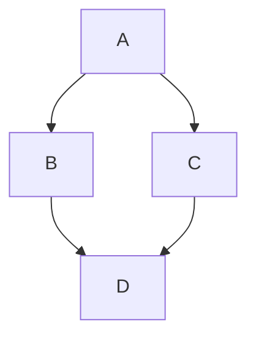

# SHED Variants
Alternates written by blasphemers and usurpers...

## Hard Eights
The great SHED schism, ignited by Justin.

The followers of this sect believe the holy texts are wrong, and one _cannot_ play an 8 on a 7. This variant interprets the rule "only a 7 or lower can be followed by a 7" with a stricter attitude. We call this interpretation playing with "hard eights", and the original vanilla version as "soft eights".

Here is a simple flow chart:

