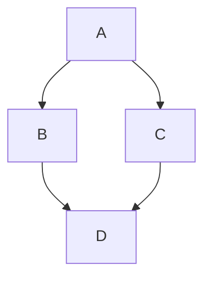

# SHED Variants
Alternates written by blasphemers and usurpers...

## Hard Eights
The great SHED schism, ignited by Justin.

The followers of this sect believe the holy texts are wrong, and one _cannot_ play an 8 on a 7. This variant interprets the rule "only a 7 or lower can be followed by a 7" with a stricter attitude. We call this interpretation playing with "hard eights", and the original vanilla version as "soft eights".

Here is a simple flow chart:

## Super 10s
10s _may_ be played on a 7
## 69 (2for1 special)
if a player has both a 6 and a 9 in their hand, they may play both (hence 2for1 special) whenever either can be played [e.g 69 can be played on a 7 and can be played on another 9]

## 69 (reverse rotation)
if at anytime a 9 is played on a 6, the flow of play is reversed between clockwise (CW) & counter-clockwise (CCW)

## Wild Jokers
Jokers may take on any value the player desires

## Tame Jokers
Jokers can only take on _visible_ values eg the players hand, any players late game, or the discard pile

## Chaos Shed
If you have a card that can be played, play it. Order be damned

## Unforced Play
Generally, if you have a card to play, you must play it ie _forced_ play. During unforced play, players may choose to not play any card(s) and end their turn whenever they like by drawing a card (invented by Christian the Davis?)
